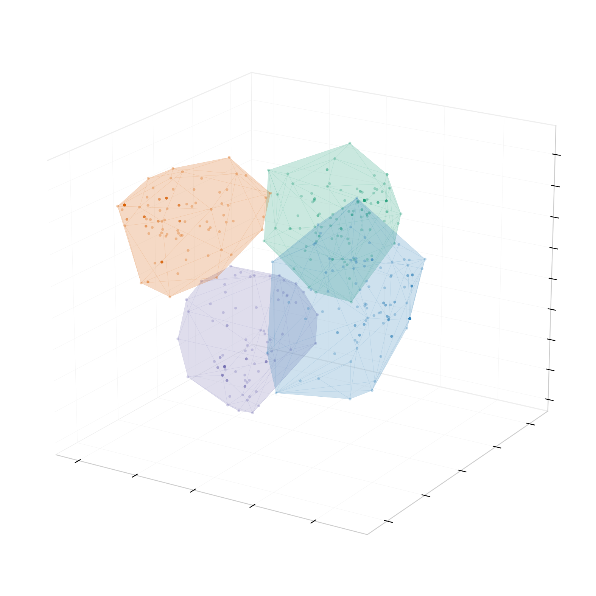

<p align="center"></p>

# categorical

Lightweight specific **MCA + HCPC** with geometric data analysis — base R, no dependencies for the statistics.

## Install

```r
# install.packages("remotes")
remotes::install_github("raymondli-me/categorical")
```

## Use

```r
library(categorical)

tt <- as.data.frame(Titanic)                                   # base-R dataset, no download
df <- tt[rep(seq_len(nrow(tt)), tt$Freq), c("Class","Sex","Age")]
df$Survived <- tt$Survived[rep(seq_len(nrow(tt)), tt$Freq)]

fit <- mca_run(df, active = c("Class","Sex","Age"), group = "Survived", k = 3)
fit
mca_report(fit)
plot_map(fit, ellipse = "centroid")
```

## Functions

`mca_run` · `mca_report` · `mca_master` · `mca_master_rows` ·
`mca_top_dim` · `mca_top_cluster` · `mca_top_group` ·
`mca_residuals` · `mca_typicality` · `mca_eta` · `mca_ellipses` · `mca_ari` ·
`plot_scree` · `plot_map` · `mca_export_fig3d` · `mca_validate`

`mca_validate()` optionally cross-checks against FactoMineR (agrees to machine precision).

## License

MIT © 2026 Raymond Li. The header figure uses illustrative synthetic data (`tools/make-hero.R`).
